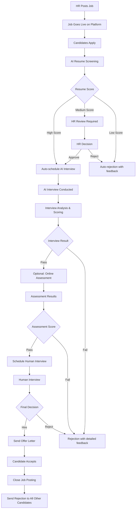
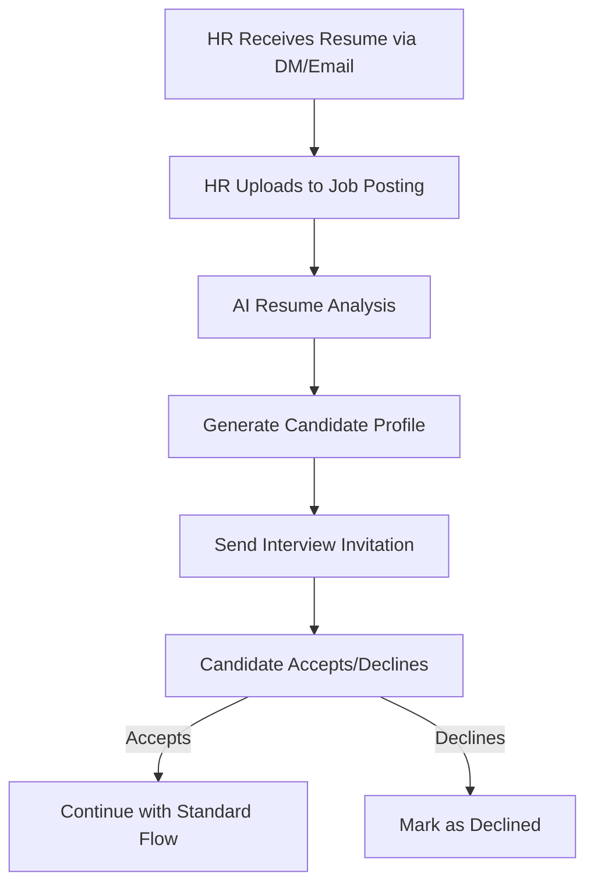

# HireFlow AI - Complete HR Automation Platform

## 🚀 Executive Summary

HireFlow AI is a comprehensive SaaS platform that automates the entire hiring pipeline from job posting to candidate onboarding. Built with AI-powered resume screening, voice interviews, and automated assessments, it reduces hiring time by 80% while maintaining quality.

## 🎯 Core Value Proposition

**For HR Teams**: Transform weeks-long hiring processes into days with intelligent automation
**For Candidates**: Transparent, efficient interview process with immediate feedback
**For Companies**: Reduce hiring costs by 60% while improving candidate quality

---

## 🏗️ System Architecture

### Phase 1: Foundation (Current - Voice Agent + Core Features)
- ✅ AI Voice Interview System (Built)
- 🔄 Resume ATS Integration
- 🔄 Basic Job Posting System

### Phase 2: Complete Pipeline (Months 1-3)
- Advanced Assessment Platform
- HR Dashboard & Analytics
- Candidate Portal
- Email Automation System

### Phase 3: Intelligence Layer (Months 4-6)
- AI Bias Detection
- Predictive Hiring Analytics
- Custom Interview Models
- Advanced Reporting

### Phase 4: Scale & Enterprise (Months 7-12)
- Multi-tenant Architecture
- Enterprise Integrations
- White-label Solutions
- Global Compliance

---

## 📋 Detailed Feature Breakdown

### 1. Job Management System

#### Job Posting Engine
```
Features:
- Rich text job descriptions with AI suggestions
- Skill-based requirement mapping
- Salary range recommendations
- Industry-specific templates
- Multi-platform publishing (LinkedIn, Indeed, etc.)
- Custom application forms
- Deadline management
```

#### Job Analytics Dashboard
```
- Application conversion rates
- Source tracking (where candidates come from)
- Time-to-hire metrics
- Cost-per-hire calculations
- Quality score trends
```

### 2. Resume Intelligence System

#### ATS (Applicant Tracking System)
```
Features:
- AI-powered resume parsing
- Skill extraction and matching
- Experience level assessment
- Education verification suggestions
- Keyword optimization scoring
- Duplicate detection
- Bias-free screening algorithms
```

#### Resume Scoring Engine
```
Algorithm Components:
- Skill match percentage (40%)
- Experience relevance (30%)
- Education alignment (15%)
- Career progression (10%)
- Additional factors (5%)

Scoring Thresholds:
- 85-100%: Auto-advance to interview
- 70-84%: HR review required
- Below 70%: Auto-reject with feedback
```

### 3. AI Interview System (Enhanced)

#### Voice Interview Platform
```
Current Features:
✅ Real-time voice conversation
✅ Sarvam AI STT/TTS integration
✅ Groq LLM for intelligent responses
✅ LiveKit infrastructure

New Enhancements:
- Multi-language support (Hindi, English, Regional)
- Industry-specific question banks
- Behavioral vs Technical interview modes
- Real-time sentiment analysis
- Stress level detection
- Communication skills assessment
- Video recording capabilities
```

#### Interview Customization
```
HR Configuration Options:
- Interview duration (15-60 minutes)
- Question difficulty levels
- Focus areas (technical/behavioral/cultural)
- Custom question addition
- Scoring criteria weights
- Pass/fail thresholds
```

#### Advanced AI Features
```
- Emotion detection during responses
- Speaking pace and clarity analysis
- Confidence level measurement
- Plagiarism detection (for technical answers)
- Cultural fit assessment
- Leadership potential indicators
```

### 4. Online Assessment Platform

#### Technical Assessment Engine
```
Features:
- Code execution environment (Python, Java, JS, etc.)
- Database query challenges
- System design questions
- MCQ with adaptive difficulty
- Time-boxed coding challenges
- Plagiarism detection with AI monitoring
- Screen recording and keystroke analysis
```

#### Proctoring System
```
AI Monitoring:
- Face detection and verification
- Multiple person detection
- Screen sharing detection
- Browser tab switching alerts
- Mobile device usage detection
- Suspicious behavior flagging
- Audio analysis for external help
```

#### Assessment Library
```
Pre-built Assessments:
- Software Engineering (Frontend/Backend/Full-stack)
- Data Science & Analytics
- Digital Marketing
- Sales & Business Development
- Customer Service
- Finance & Accounting
- HR & Operations
- Custom assessment builder
```

### 5. HR Dashboard & Analytics

#### Main Dashboard
```
Key Metrics:
- Active job postings
- Applications received today/week
- Interview completion rates
- Candidate pipeline status
- Hiring funnel conversion
- Time-to-hire averages
- Cost analytics
- Team performance metrics
```

#### Advanced Analytics
```
Reports & Insights:
- Hiring trend analysis
- Source effectiveness reports
- Candidate quality scoring
- Interview performance trends
- Bias detection reports
- Predictive hiring recommendations
- ROI calculations
- Competitive benchmarking
```

#### Team Management
```
Features:
- Multi-user access with role-based permissions
- Interview scheduling coordination
- Collaborative candidate evaluation
- Internal feedback systems
- Approval workflows
- Communication logs
```

### 6. Candidate Experience Portal

#### Application Tracking
```
Candidate Dashboard:
- Application status in real-time
- Interview scheduling system
- Preparation resources
- Feedback access (post-interview)
- Document upload portal
- Communication center
- Mobile-responsive design
```

#### Self-Service Features
```
- Profile management
- Skill assessments
- Interview rescheduling
- Status notifications
- Feedback surveys
- Job recommendation engine
```

### 7. Communication & Automation System

#### Email Automation
```
Automated Workflows:
- Application confirmation
- Interview invitations
- Reminder notifications
- Result communications
- Rejection notifications (with feedback)
- Offer letters
- Onboarding sequences
```

#### Notification System
```
Multi-channel Notifications:
- Email notifications
- SMS alerts
- In-app notifications
- Slack/Teams integrations
- Calendar integrations
- Mobile push notifications
```

### 8. Integration & API Layer

#### Third-party Integrations
```
HR Systems:
- Workday, BambooHR, SAP SuccessFactors
- ATS systems (Greenhouse, Lever, etc.)
- Calendar systems (Google, Outlook)
- Video conferencing (Zoom, Teams)
- Background check services
- Reference check platforms
```

#### API Framework
```
RESTful APIs for:
- Job posting management
- Candidate data sync
- Interview scheduling
- Assessment results
- Analytics data export
- Webhook integrations
```

---

## 🔄 Complete Workflow Implementation

### Workflow 1: HR Posts Job → AI Screening → Interview



### Workflow 2: Resume Upload by HR



---

## 💾 Database Schema

### Core Tables
```sql
-- Companies
companies (id, name, domain, subscription_plan, created_at, settings)

-- Users (HR Team Members)
users (id, company_id, email, role, permissions, created_at)

-- Job Postings
jobs (id, company_id, title, description, requirements, status, created_by, created_at, closed_at)

-- Candidates
candidates (id, email, name, phone, resume_url, created_at, source)

-- Applications
applications (id, job_id, candidate_id, status, applied_at, resume_score, notes)

-- Interview Sessions
interviews (id, application_id, type, scheduled_at, conducted_at, status, ai_score, human_score, feedback)

-- Assessments
assessments (id, application_id, assessment_type, started_at, completed_at, score, details, proctoring_flags)

-- Communications
communications (id, application_id, type, subject, content, sent_at, status)
```

### AI-Specific Tables
```sql
-- Interview Transcripts
interview_transcripts (id, interview_id, timestamp, speaker, content, sentiment_score)

-- AI Analysis Results
ai_analysis (id, interview_id, confidence_score, communication_skills, technical_skills, cultural_fit, recommendations)

-- Assessment Results
assessment_results (id, assessment_id, question_id, answer, is_correct, time_taken, flagged_behavior)
```

---

## 🛠️ Technology Stack

### Backend Architecture
```
Primary Framework: FastAPI (Python)
Database: PostgreSQL + Redis (caching)
AI/ML: 
  - Groq API (LLM)
  - Sarvam AI (STT/TTS)
  - Custom ML models for analysis
Real-time: WebSockets (LiveKit)
File Storage: AWS S3 / Google Cloud Storage
Queue System: Celery + Redis
```

### Frontend Stack
```
Web App: React + TypeScript + Tailwind CSS
Mobile Apps: React Native (iOS/Android)
State Management: Redux Toolkit
Real-time: Socket.io client
Charts: Chart.js / D3.js
```

### Infrastructure
```
Cloud Provider: AWS / Google Cloud / Azure
Containerization: Docker + Kubernetes
CI/CD: GitHub Actions
Monitoring: Sentry + DataDog
CDN: CloudFlare
```

### AI/ML Pipeline
```
Voice Processing: LiveKit + Sarvam AI
LLM: Groq (llama-3.3-70b-versatile)
Resume Parsing: Custom NLP models
Assessment Engine: Custom code execution environment
Proctoring: Computer vision models
Analytics: Custom ML algorithms
```

---

## 🚀 Implementation Roadmap

### Month 1: Foundation
**Week 1-2: Core Infrastructure**
- [ ] Set up development environment
- [ ] Database schema implementation
- [ ] Basic API framework
- [ ] Authentication system
- [ ] Company registration flow

**Week 3-4: Job Management**
- [ ] Job posting CRUD operations
- [ ] Job listing page (public)
- [ ] Application submission system
- [ ] File upload handling
- [ ] Basic email notifications

### Month 2: AI Integration
**Week 1-2: Resume Intelligence**
- [ ] Resume parsing engine
- [ ] Skill extraction algorithms
- [ ] Scoring system implementation
- [ ] ATS dashboard for HR
- [ ] Bulk resume upload

**Week 3-4: Voice Interview Enhancement**
- [ ] Integration of existing voice agent
- [ ] Interview question bank
- [ ] Recording capabilities
- [ ] Sentiment analysis
- [ ] Interview result dashboard

### Month 3: Assessment Platform
**Week 1-2: Technical Assessments**
- [ ] Code execution environment
- [ ] Question bank creation
- [ ] Assessment builder UI
- [ ] Candidate assessment portal
- [ ] Auto-grading system

**Week 3-4: Proctoring System**
- [ ] AI-powered monitoring
- [ ] Behavioral analysis
- [ ] Cheating detection
- [ ] Report generation
- [ ] Review interface for HR

### Month 4: Advanced Features
**Week 1-2: Analytics & Reporting**
- [ ] Advanced dashboard
- [ ] Custom report builder
- [ ] Data export functionality
- [ ] Predictive analytics
- [ ] Bias detection algorithms

**Week 3-4: Integration Layer**
- [ ] Third-party integrations
- [ ] API development
- [ ] Webhook system
- [ ] Calendar integrations
- [ ] Email service providers

### Month 5: User Experience
**Week 1-2: Mobile Applications**
- [ ] React Native app development
- [ ] Push notifications
- [ ] Offline capabilities
- [ ] Mobile-optimized interviews
- [ ] App store deployment

**Week 3-4: UI/UX Polish**
- [ ] Design system implementation
- [ ] Accessibility improvements
- [ ] Performance optimization
- [ ] User onboarding flows
- [ ] Help documentation

### Month 6: Enterprise Features
**Week 1-2: Multi-tenancy**
- [ ] Company isolation
- [ ] Role-based access control
- [ ] Custom branding options
- [ ] Data security compliance
- [ ] Backup and recovery

**Week 3-4: Scalability**
- [ ] Load balancing setup
- [ ] Database optimization
- [ ] Caching strategies
- [ ] CDN implementation
- [ ] Performance monitoring

---

## 💰 Business Model & Pricing

### Pricing Tiers

**Starter Plan - $49/month**
- Up to 5 active job postings
- 50 candidate applications/month
- Basic AI interviews
- Email support
- Standard reports

**Professional Plan - $149/month**
- Unlimited job postings
- 200 candidate applications/month
- Advanced AI interviews + assessments
- Phone support
- Advanced analytics
- API access

**Enterprise Plan - $499/month**
- Unlimited everything
- White-label options
- Custom integrations
- Dedicated support
- Custom ML model training
- SLA guarantees

**Pay-per-use Add-ons**
- Additional interviews: $2 per interview
- Premium assessments: $5 per assessment
- Video interviews: $3 per interview
- Priority support: $200/month

### Revenue Projections
```
Year 1 Target: $120K ARR (Annual Recurring Revenue)
- 100 Starter customers: $58.8K
- 50 Professional customers: $89.4K
- 5 Enterprise customers: $29.9K

Year 2 Target: $500K ARR
Year 3 Target: $2M ARR
```

---

## 🔐 Security & Compliance

### Data Protection
- [ ] GDPR compliance
- [ ] SOC 2 Type II certification
- [ ] End-to-end encryption
- [ ] Regular security audits
- [ ] Data anonymization options

### Privacy Features
- [ ] Candidate data deletion
- [ ] Right to be forgotten
- [ ] Data portability
- [ ] Consent management
- [ ] Audit logging

---

## 📊 Success Metrics & KPIs

### Product Metrics
- Time to hire reduction: Target 80%
- Interview completion rate: Target 85%
- False positive rate: Target <5%
- Customer satisfaction: Target 4.5/5
- Platform uptime: Target 99.9%

### Business Metrics
- Monthly Recurring Revenue (MRR) growth
- Customer Acquisition Cost (CAC)
- Customer Lifetime Value (CLV)
- Churn rate: Target <5% monthly
- Net Promoter Score (NPS): Target 70+

---

## 🔮 Future Enhancements

### AI Advancements
- [ ] Custom LLM fine-tuning per company
- [ ] Multi-modal AI (voice + video analysis)
- [ ] Predictive candidate success scoring
- [ ] Automated job description generation
- [ ] Real-time language translation

### Platform Extensions
- [ ] Onboarding automation
- [ ] Performance management integration
- [ ] Employee referral systems
- [ ] Talent pipeline management
- [ ] Diversity & inclusion analytics

### Market Expansion
- [ ] Industry-specific solutions
- [ ] Geographic expansion
- [ ] Partner marketplace
- [ ] Reseller programs
- [ ] Acquisition opportunities

---

## 📝 Next Steps

### Immediate Actions (This Week)
1. **Technical Setup**
   - Set up project repository
   - Configure development environment
   - Create database schemas
   - Set up CI/CD pipeline

2. **Team Assembly**
   - Frontend developer (React/TypeScript)
   - Backend developer (Python/FastAPI)
   - ML engineer (AI/ML models)
   - Product designer (UI/UX)

3. **Market Validation**
   - Interview 20 HR managers
   - Validate pricing assumptions
   - Analyze competitor features
   - Create MVP feature list

### Week 2-4: MVP Development
- Core job posting system
- Basic resume upload/parsing
- Simple interview scheduling
- Integration of existing voice agent
- Basic HR dashboard

---

## 📞 Contact & Support

For technical questions about implementation or architecture decisions, please refer to:
- Technical documentation in `/docs`
- API documentation at `/api/docs` 
- Development setup guide in `SETUP.md`

---

*This README will be updated as we progress through development phases. Last updated: November 3, 2025*
